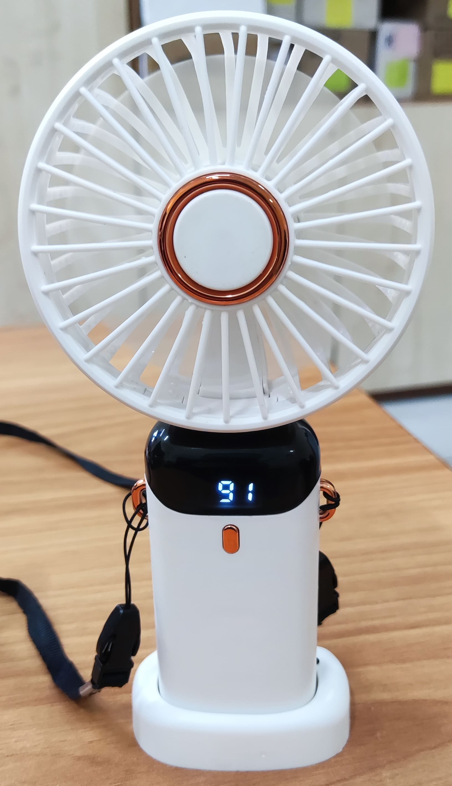

## Ремонт (переделка) портативного вентилятора на ATmega8L-8AU.

IDE: _Arduino IDE v2.3.6_

Плата: _MiniCore (ATmega8)_

BOD: _2.7V_

Bootloader: _No bootloader_

Clock: _Internal 8 MHz_

EEPROM: _EEPROM retained_

Compiler LTO: _LTO enabled_

Программатор: _USBasp_

_Проект полностью открыт и распространяется по лицензии MIT._

Ссылки на [GitHub](https://github.com/Otto17/Portable_Fan) и [GitFlic](https://gitflic.ru/project/otto/portable_fan).

---

_P.S._ Переделку делал для себя, так как была по невнимательности переполюсовка аккумулятора и микросхемы вентилятора сгорели.
В наличии валялись МК ATmega8L-8AU, решил переделать, так как вентилятор вполне хорошо дует, ещё можно носить на шее.

Хоть код и писал в Arduino IDE v2, но старался работать с регистрами на прямую для обхода прослойки Arduino, тем самым увеличив скорость работы с портами и повышения общей производительности кода.

---

**Описание работы:**

После подачи питания МК сразу входит в режим глубокого сна.

При первом нажатии кнопки включается вентилятор на 35% мощности (ШИМ на частоте _~34.48 кГц_), на индикаторе отображается цифра '1' - первый режим мощности (всего их 4), затем через 3 сек. отображается заряд аккумулятора в процентах (_0% - 2.9V; 100% - 4.2V_), затем ещё через 3 сек. отображается температура (в ℃, а так же со штрихов в первом сегменте, что бы отличать температуру от напряжения аккумулятора) и далее по кругу.

При втором нажатии кнопки вентилятор переключается на 50% мощности, при третьем нажатии на 75% мощности и при четвёртом нажатии 100% мощности (ШИМ отключается и подаётся постоянное напряжение).

После 4 режима нажатие кнопки отключает вентилятор и отправляет МК в глубокий сон.

---

**Компоненты:**

В проекте используются: МК ATmega8L-8AU, NTC термистор (в нижнем плече) на 10k с резистором на 10k (в верхнем плече).

На штатной плате расположены кнопка, мультиплексный семисегментный индикатор из трёх сегментов - \[1 8 8\], микросхема заряда Li-ion и полевым транзистором управления самим вентилятором.

Скетч занимает 48% памяти МК и 19% ОЗУ.

Потребление тока в режиме сна **16 мкА**, 1 режим **63 мА**, 2 режим **120 мА**, 3 режим **290 мА**, 4 режим **500 мА**.

Потребление всех зажжённых сегментов **~14 мА** (указано потребление только сегментов, все 5 выводом подключены через резисторы на **100 Ом**).

Зарядка через микросхему **LTC4054-4.2** (маркировка **LTH7R**) током до 500 мА.

---

**Используемые пины:**

* Кнопка (INPUT\_PULLUP, подключена между pin и GND напрямую + использует прерывание): PD2 (на плате Pin 32, в Arduino Pin 2).
* Мотор (ШИМ): PB1 (на плате Pin 13, в Arduino Pin 9).
* Мультиплексный семисегментный индикатор \[1 8 8\]: PC0 - PC4 (на плате Pin с 23 по 27, в Arduino Pin с 14 по 18).
* Датчик температуры NTC (нижнем плече):
\- NTC термистор одной ногой подключается к GND.
\- Вторая нога термистора соединяется с верхним плечом делителя (первая нога резистор 10 кОм), образуя среднюю точку.
\- Средняя точка делителя (между термистором и резистором) подключается к аналоговому входу ADC6 (на плате Pin 19, в Arduino Pin A6).
\- Вторая нога резистора подключается к цифровому пину PB0 (на плате Pin 12, в Arduino Pin 8).

---

**Фотографии:**

****
****

Другие фотографии в папке “_Photo_”.

---

**Автор Otto, г. Омск 2025**